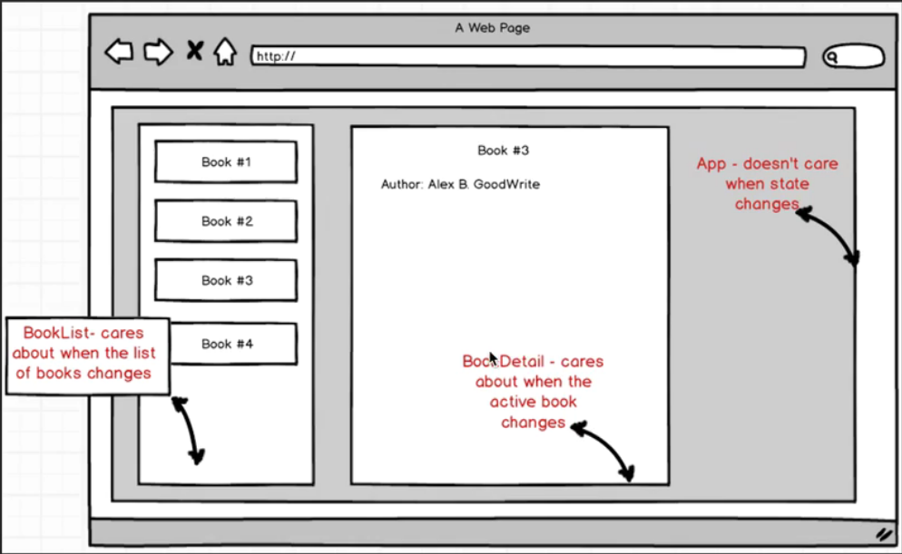
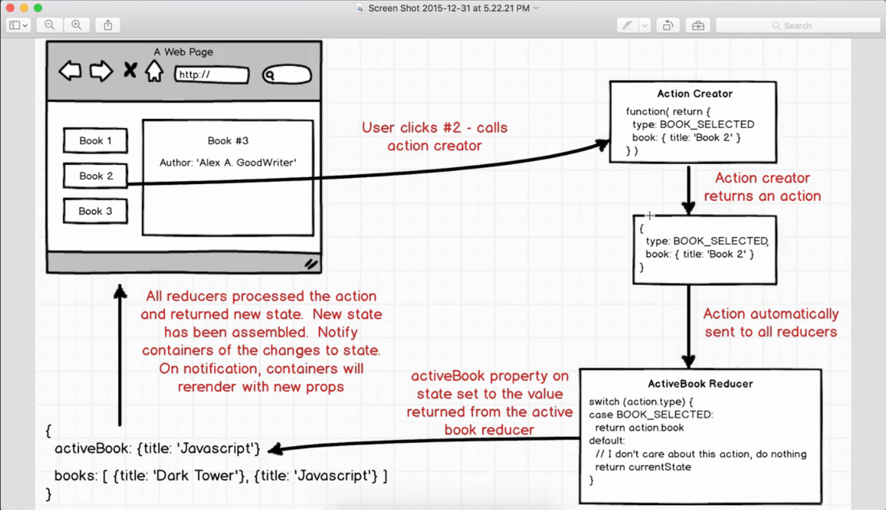

# Redux - Book List project.

**reducers**: is a function that returns a piece of the app state. Produce the value of the state.

 

 

We have two reducers here: Books and ActiveBooks.

Created React-Redux component BookList

components/app.js
* We import BookList and return that component using React

containers/book_list.js
* we import react-redux
* we create a React style class without exporting it
* This BookList returns a map of props.Books

* The 'glue' function mapStateToProps() to return the state.books

* We use redux connect & wrap mapStateToProps & utilize BookList reducer

reducers/reducer_books.js  
We just create reducer data for BookList
