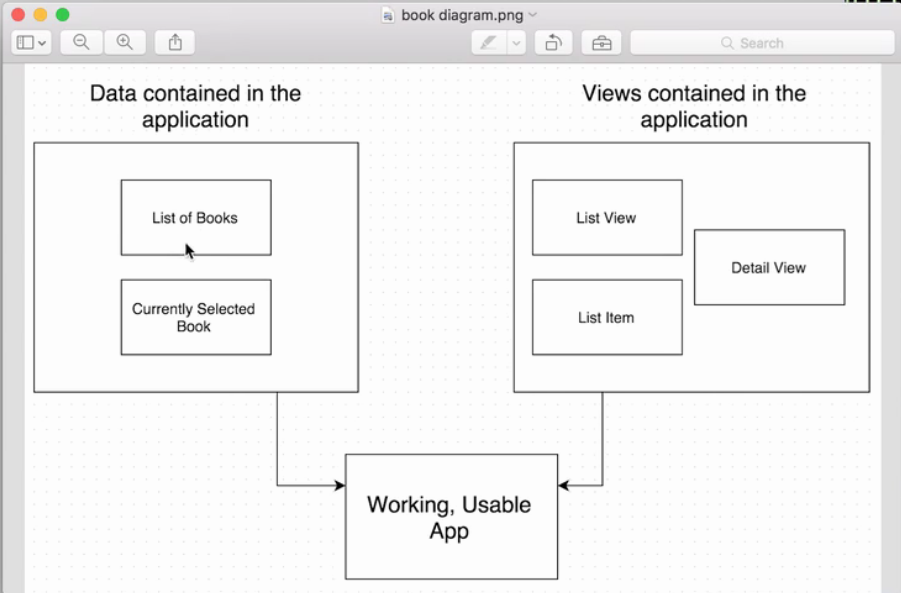
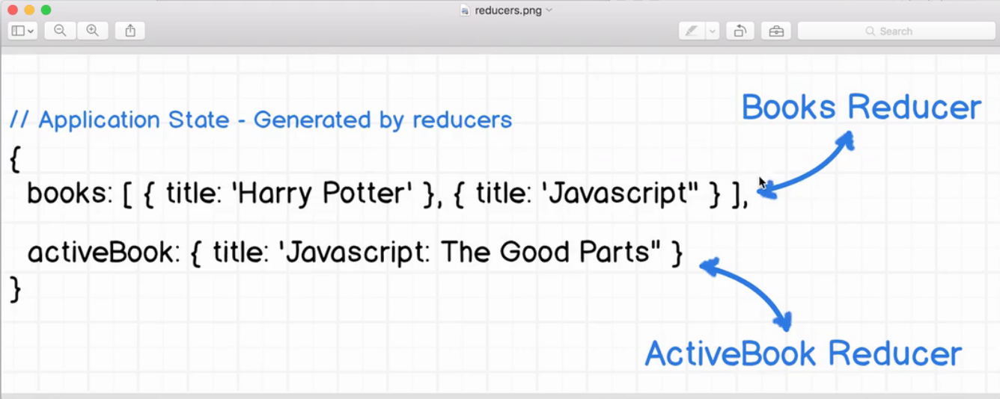

# Redux - Book List project.

**reducers**: is a function that returns a piece of the app state. Produce the value of the state.

 

We have two reducers here: Books and ActiveBooks.

Building the first reducer:
* 
